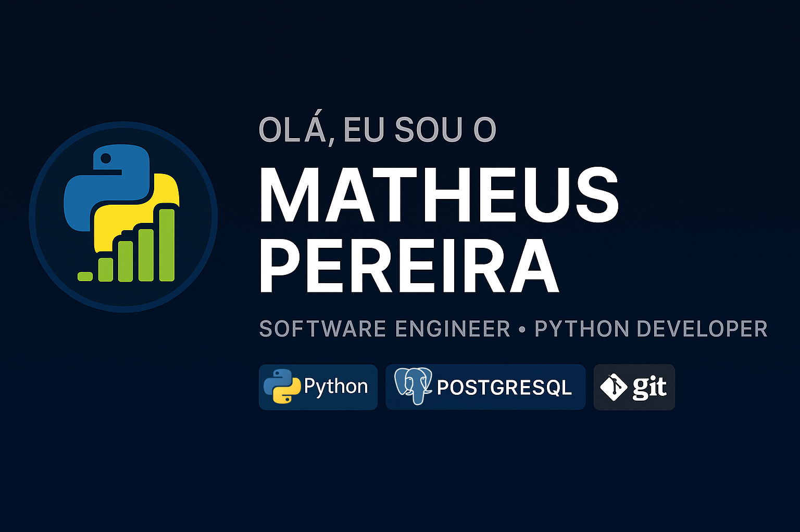

  
  <b>Software Engineer | Python Developer | Estudante de Engenharia de Software</b> 
  Atualmente cursando Engenharia de Software na <b>Faculdade de Nova Serrana – FANS</b>.

---

## 📌 Sobre Mim

- Estudante de **Engenharia de Software** pela **FANS – Faculdade de Nova Serrana**.  
- Desenvolvedor **Python**, com foco em automação, ferramentas e aplicações desktop.  
- Interessado em práticas de arquitetura, documentação técnica e engenharia de software.  
- Buscando oportunidades para aplicar e evoluir minhas habilidades.

---

## 🧠 Tecnologias & Ferramentas

  
  
  
  
  
  
  
  

---

## 📂 Projetos em Destaque

### **Controle de Ponto Corporativo**
- Aplicação desktop desenvolvida em Python + PyQt6 para controle de ponto corporativo, permitindo o registro de entrada/saída de funcionários.

Repositório: https://github.com/MatheusPereiira/staff-time-tracking 

---

### **Sistema ERP**
- Sistema ERP Desktop desenvolvido em Python, com foco em gestão comercial, financeira, controle de estoque e cadastros.

Repositório: https://github.com/MatheusPereiira/python-erp

---

## 📍 Onde me Encontrar

👤 **LinkedIn:**  
https://www.linkedin.com/in/matheus-pereira-722360398/

📧 **Email:**  
sabonaltacontato@hotmail.com

💻 **GitHub:**  
https://github.com/MatheusPereiira

---

<h3 align="center">Obrigado por visitar meu perfil!</h3>

Fique à vontade para explorar meus projetos ou entrar em contato.

